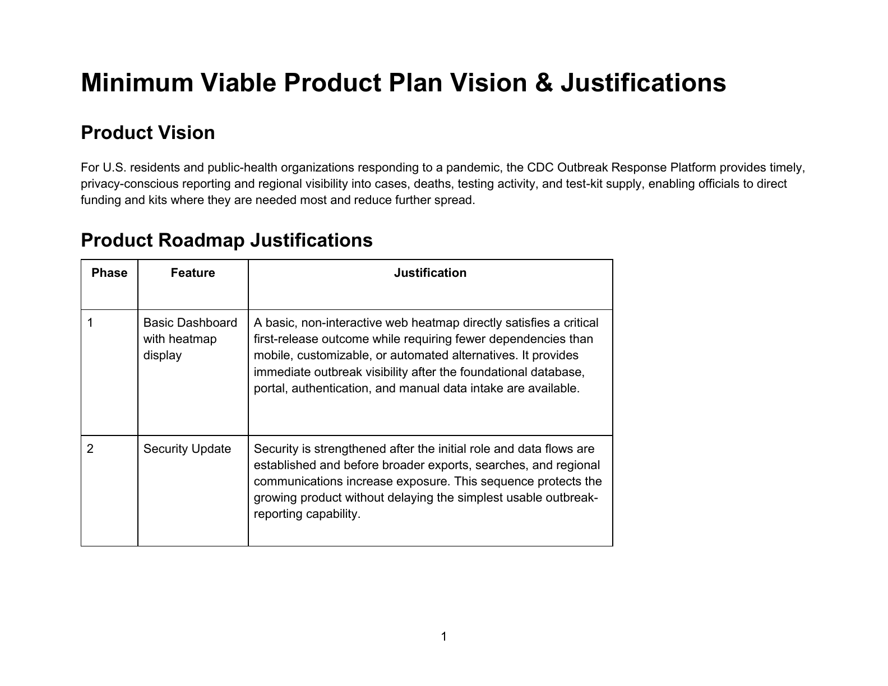
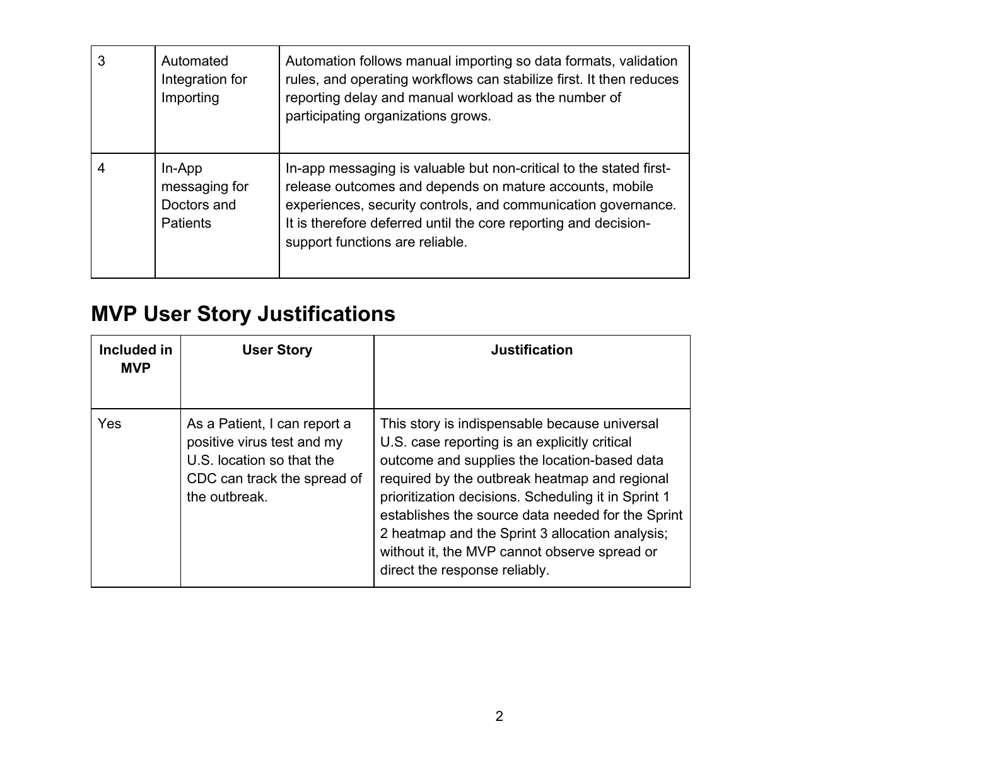
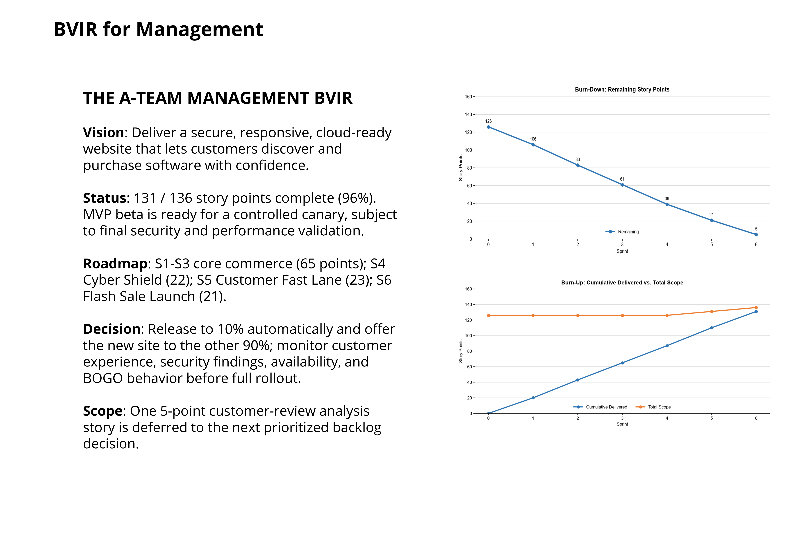
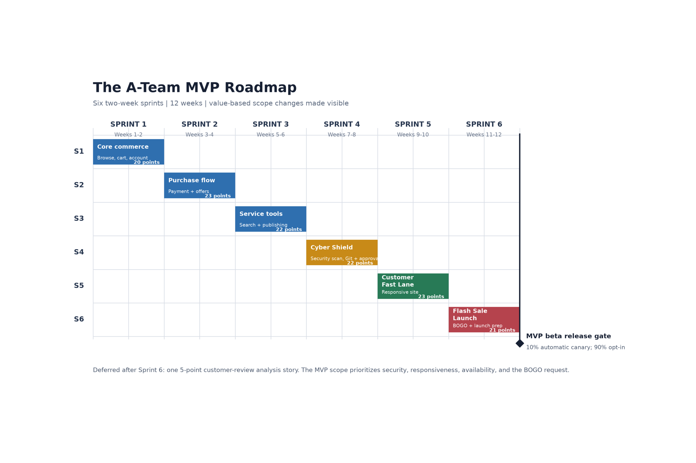

# Agile Software Development Portfolio

Three end-to-end Agile delivery projects: defining a public-health MVP, preparing a distributed travel-product team for an Agile launch, and communicating six sprints of delivery progress to management.

## Projects

### P1. [CDC Outbreak Response MVP Plan](minimum-viable-product/)

High-level goal: Prioritize a minimum viable CDC outbreak-response platform that enables timely case reporting, regional visibility, testing and test-kit tracking, and evidence-based allocation decisions.

Technologies used: Agile product visioning, product roadmaps, release planning, user stories, acceptance criteria, MVP prioritization, Microsoft Excel, Microsoft Word.

### P2. [WorldVisitz Mobile Application Agile Delivery Launch](mobile-app-agile-launch/)

High-level goal: Make the executive case for Agile and onboard a distributed travel-product team to a Scrum-based delivery model supported by XP engineering practices.

Technologies used: Agile Manifesto, Scrum, Kanban, Extreme Programming, information radiators, sprint ceremonies, Definition of Done, Shu Ha Ri coaching, Microsoft PowerPoint.

### P3. [The A-Team Agile Communication Project](executing-agile-team/)

High-level goal: Track and communicate six sprints of a software-commerce MVP through backlog evolution, burn-down and burn-up reporting, committed-versus-delivered analysis, and a management BVIR.

Technologies used: Scrum, sprint planning, story-point estimation, burn-down charts, burn-up charts, committed-versus-delivered reporting, management dashboards, Python, Matplotlib, Microsoft PowerPoint, Microsoft Excel.

