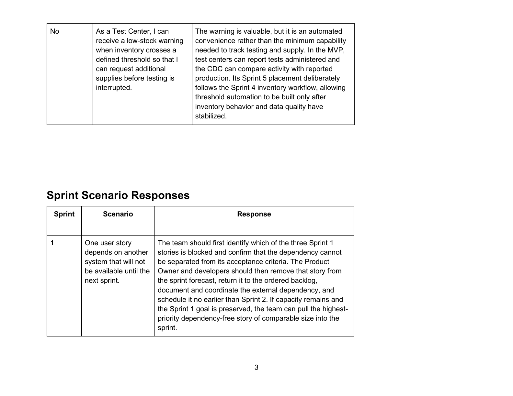
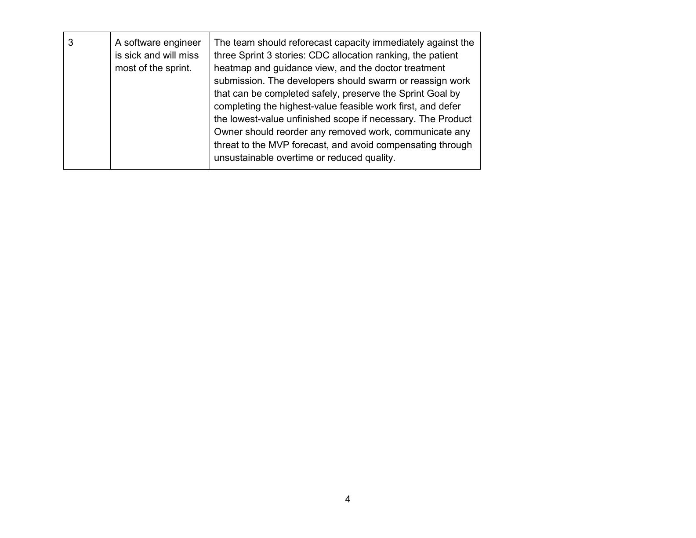

# CDC Outbreak Response MVP Plan

This project defines a minimum viable product for a CDC outbreak-response platform during a pandemic. The plan focuses the first release on timely, privacy-conscious reporting and regional visibility so public-health officials can direct test kits and funding where they are needed most.

## Product approach

The MVP is organized around a clear product vision, a four-phase roadmap, a sequenced release plan, and role-based user stories with acceptance criteria. Prioritization favors the critical public-health outcomes and lower-dependency capabilities first:

- U.S. residents can report positive cases and locations.
- Officials gain an outbreak heatmap and visibility into cases, deaths, testing activity, and test-kit supply.
- Health-care organizations can report test-kit production and administration.
- Medical examiners can report virus-related deaths.

The roadmap deliberately begins with a basic, non-interactive web dashboard and manual intake before advancing to security improvements, automated integration, and later communications features. The MVP rationale explains why universal case reporting is essential to the heatmap and allocation decisions, while automated low-stock warnings are deferred until underlying inventory data and workflows have stabilized.

## Sprint planning

The delivery plan uses two-week sprints and an eight-story-point capacity. It sequences user value and dependencies while preserving a workable product. The plan also documents how to respond when an external dependency blocks a story or reduced capacity threatens a sprint: protect the sprint goal, reforecast transparently, reorder the backlog, and avoid unsustainable overtime or reduced quality.

## Final plan

Select an image to view it at full size.

## Files

- [MVP vision and justifications (PDF)](Minimum%20Viable%20Product%20Plan%20Vision%20%26%20Justifications.pdf)
- [MVP vision and justifications (Word)](Ohara%20-%20Minimum%20Viable%20Product%20Plan%20Vision%20%26%20Justifications.docx)
- [MVP plan spreadsheet](Minimum%20Viable%20Product%20Plan.xlsx)
